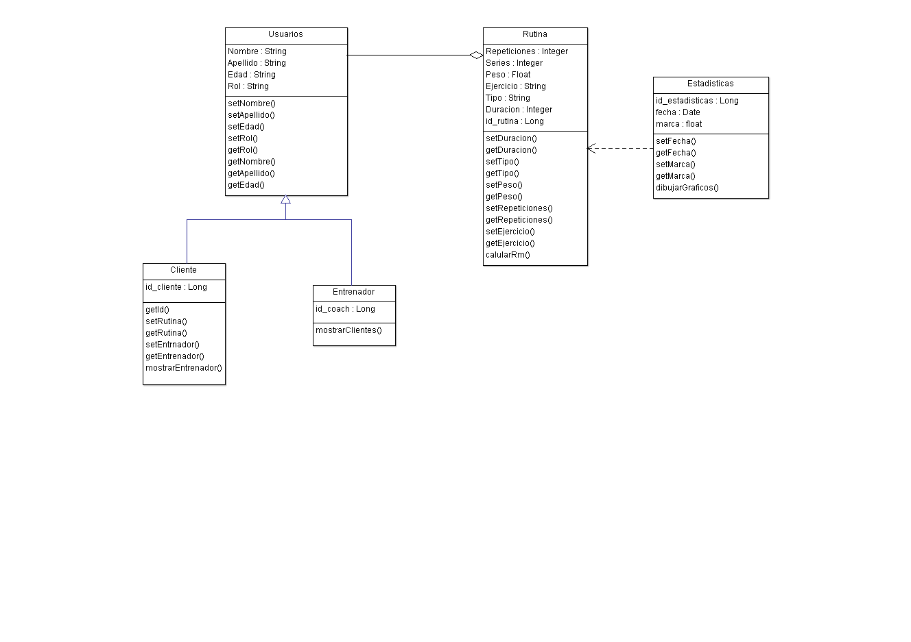
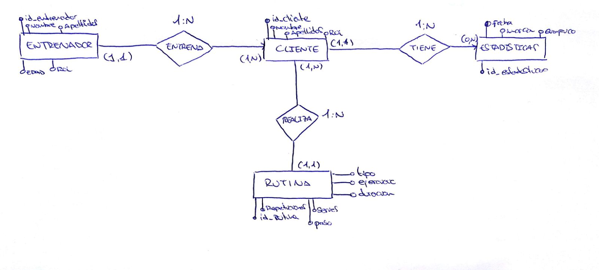
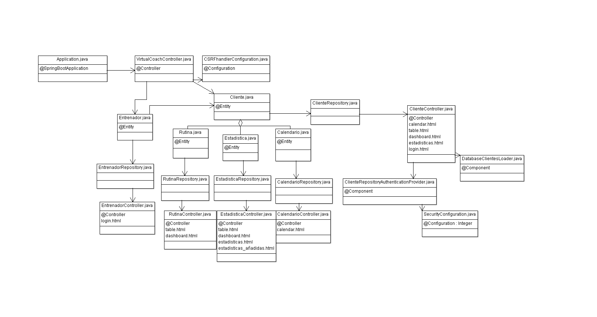


# VIRTUALCOACH
## Diseño de Aplicaciones Distribuidas  


### **Descripción:** 
  
  **VirtualCoach** es una herramienta para la gestión y optimización del rendimiento deportivo, en la cual el entrenador podrá monitorizar tus entrenamientos y adaptarlos para conseguir nuestros objetivos de forma más eficiente.
  Visualice el siguiente video haciendo click en el:


  
  []
  (https://youtu.be/J7c65uvIAcE)


  Para el uso de la herramienta el Coach debe introducir los datos necesarios de cada entrenamiento.  

  El cliente puede ver sus avances y competir con otros usuarios.  

  La herramienta se divide en dos partes:   
    
  - **Pública:** Rating de cada uno de los usuarios, comparando y creando clasificaciones dependiedo del avance en las sesiones.
    
  - **Privada:** Seguimiento personal del avance del usuario, mostrando gráficas y datos de las sesiones de entrenamiento.
  

  - - -
### **Entidades:**
  
  1. **Usuarios.**    

  Los usuarios se pueden dividir en diferentes roles:  

   * Entrenador: dispondrá de un grupo de clientes, con los que podrá contactar, ajustando la rutina para que se adecue a cada cliente. Además puede ver todos los datos guardados por parte del cliente referentes al entrenamiento.
   * Cliente: dispondrá de una rutina, la cual es enviada por el entrenador. Puede preguntar y contar experiencias, sensaciones al entrenador. Puede ver las gráficas de su propio rendimiento, pudiendo visualizar en qué momentos está mejorando y en cuales no.


  2. **Entrenamientos.**  
    
      Histórico y propiedades  de los entrenamientos.

  3. **Estadisticas.**
      
      - Seguimiento diario de los entrenamientos del cliente, problemas encontrados, records personales, etc.  

      - Visualización del progreso deportivo a lo largo del tiempo mediante gráficas desarrolladas por el servicio interno  
       y pintadas mediante una API de procesamiento de Gráficas.  

  4.  **Rutina**  
      Diferentes tipos de rutina, dependiendo del objetivo deseado, puediendo diferenciar entre rutinas de fuerza, resistencia, etc.

  - - -

### **Servicio Interno.**
El servicio interno envía por medio de API REST un e-mail al cliente, nada más registrarse, indicando que el registro ha sido correcto. El e-mail destino es la dirección que utiliza el cliente para registarse. También se implementa un método para validar el e-mail, y de no ser una dirección correcta no se efectuará el regitro ni el envío.

### **Diagrama de Clases:**  

  Adjuntamos un pequeño Diagrama de Clases de la Aplicación, aunque lo dejamos abierto para posibles modificaciones en el futuro como puede ser agregar metodos,
  clases o eliminar alguno de los anteriores.
  
  

  - - -
### **Diagrama Entidad/Relación:**


- - -
### **Diagrama de Clases y Templates:**  

  Adjuntamos un pequeño Diagrama de Clases y Templates de la Aplicación.
  
  
- - -
### **¿Cómo desplegar VirtualCoach en Azure?**

Generar un certificado .pem para acceder a la máquina virtual:
```
openssl req -x509 -nodes -days 365 -newkey rsa:2048 -keyout azureus.key -out azureus-cert.pem
```
Proteger la clave privada:
```
 chmod 0600 azureus.key
```
Crearemos una maquina virtual en Azure con una imagen preestablecida Ubuntu Server 16.04 y usando el certificado creado anteriormente.

Para acceder desde la herramienta Git ejecutamos el commando ssh:
```
ssh /path/to/azureus.key azureuser@ip_publica
```
Una vez dentro de la maquina virtual, instalaremos Java 1.8:
```
 sudo add-apt-repository ppa:openjdk-r/ppa
 sudo apt-get update
 sudo apt-get install openjdk-8-jre
```
Tras esto guardamos una imágen para poder crear mas Máquinas Virtuales solo de Java

Instalamos  MySQL:
```
 sudo apt-get update
 sudo apt-get install -y mysql -server
```
Y configuramos la base de datos, solo es necesario ejecutar el primer comando, si no queremos establecer un usuario con privilegios de Administrador, el usuario root, ya tiene estos privilegios:

```

  mysql -u root -p;

```

  Una vez dentro:
```
      mysql> create database "nombre";
      mysql> create user 'usuario'@'%' identified by 'nombre';
      mysql> grant all privileges on nombre.* to 'usuario'@'%';
      mysql> flush privileges;
      mysql> exit;
```
Crear el ejecutable de nuestra aplicacion, haciendo Run as > Maven Install en el STS.

Subir el ejecutable desde nuestro equipo a la Maquina Virtual, mediante el siguiente comando:
```
scp -i /path/to/azureus.key aplicacion.jar azureuser@<ip publica>:/home/azureuser/
```
Para ejecutar la aplicación deberemos acceder a nuestra Maquina Virtual:
ssh /path/to/azureus.key azureuser@"ip publica"

Ejecutar la aplicacion desde la maquina virtual:
```
java -jar aplicacion.jar(si la base de datos en la Maquina Virtual tiene un usuario/contraseña diferente a la creada en local debemos ejecutar este comando con --spring.datasource.username="nombre_usuario/spring.datasource.password=contraseña")
```
Acceder via web a la aplicación:
https://<ip publica>:<puerto publico>
### **Mapa Navegación:** 

El mapa de navegación se ha realizado mediante la herramienta de FluidUi, una herramienta para generación de Mockups, por lo tanto esta aplicación pude 
generar un flujo de pantallas enlazando unas con otras.

[VirtualCoach MockUp](https://marvelapp.com/50ihf00)
- - -
### **Integrantes del equipo de desarrollo:**

  - Adrián Pérez Fernández. [a.perezfernandez@alumnos.urjc.es](a.perezfernandez@alumnos.urjc.es)
  - Óscar Repiso Bravo. [o.repiso@alumnos.urjc.es](o.repiso@alumnos.urjc.es) 
  - [VirtualCoach DashBoard]( https://trello.com/b/UXnlMufa)

- - -